# OpenVPN Tunnel Management System

A comprehensive VPN tunnel management system that combines OpenVPN with stunnel for enhanced security and network restriction bypass capabilities. This system allows users to create VPN accounts with custom expiration dates (1-36500 days) and provides a dual-layer architecture for maximum security and flexibility.

## 🚀 Features

### Enhanced OpenVPN Installer (`openvpn-install.sh`)
- **🎯 User Expiration Management**: Create VPN users with custom certificate expiration dates (1-36500 days) - Perfect for temporary access, contractors, or time-limited projects
- **🔗 IR VPS Integration**: Automatically configures .ovpn files to connect to your IR server with proper protocol settings
- **⚙️ Smart Configuration**: Auto-fixes `proto tcp-client` to `proto tcp` and updates remote server addresses
- **Multi-Platform Support**: Debian, Ubuntu, CentOS, Rocky Linux, AlmaLinux, Fedora, Amazon Linux, Oracle Linux, Arch Linux
- **Advanced Security**: Strong encryption, certificate management, firewall configuration
- **DNS Options**: Multiple DNS providers including self-hosted Unbound resolver

### Stunnel Tunnel Manager (`openvpn-stunnel.py`)
- **Dual-Layer Architecture**: Non-IR server (external) + IR server (internal) setup
- **SSL/TLS Encryption**: Additional encryption layer via stunnel
- **Containerized Deployment**: Docker-based stunnel services
- **Certificate Management**: Automatic SSL certificate generation and distribution
- **Service Control**: Start/stop tunnel services with health monitoring

## 🏗️ Architecture

### System Overview


### Network Flow


## 📋 Prerequisites

### System Requirements
- **Operating System**: Linux (Ubuntu/Debian/CentOS/Rocky/AlmaLinux/Fedora/Amazon Linux/Oracle Linux/Arch Linux)
- **Root Access**: Required for installation and configuration
- **Docker**: For stunnel containerized services
- **Internet Connection**: For downloading dependencies and certificates

### Hardware Requirements
- **RAM**: Minimum 512MB, Recommended 1GB+
- **Storage**: Minimum 1GB free space
- **CPU**: Any modern x86_64 processor

## ✅ Tested Environment

This project has been tested and verified to work with the following configurations:

### Tested Platforms
| Component | Version | Status |
|-----------|---------|--------|
| **Docker** | 27.5.1 | ✅ Tested |
| **Docker Compose** | 1.29.2 | ✅ Tested |
| **Ubuntu** | 22.04.5 LTS | ✅ Tested |

### Compatibility Notes
- **Docker 27.5.1**: Full compatibility with containerized stunnel services
- **Docker Compose 1.29.2**: All compose configurations tested and working
- **Ubuntu 22.04.5 LTS**: Complete system integration verified

> **Note**: While tested on Ubuntu 22.04.5 LTS, the system should work on other supported Linux distributions. If you encounter issues on different platforms, please report them in the GitHub issues.

## 🛠️ Installation

### Quick Start

1. **Clone the repository**:
```bash
git clone https://github.com/yourusername/openvpn-tunnel-manager.git
cd openvpn-tunnel-manager
```

2. **Run the stunnel manager**:
```bash
python3 openvpn-stunnel.py
```

3. **Follow the setup wizard** to configure your server type

## 🔧 Configuration

### Server Types

#### Non-IR Server (External VPN Server)
- **Purpose**: Main OpenVPN server with stunnel encryption
- **Location**: Outside restricted networks
- **Functions**:
  - Runs OpenVPN server
  - Provides stunnel SSL/TLS encryption
  - Manages VPN certificates
  - Handles user authentication

#### IR Server (Internal Tunnel Server)
- **Purpose**: Internal server that tunnels to Non-IR server
- **Location**: Inside restricted networks
- **Functions**:
  - Connects to Non-IR server via stunnel
  - Provides local VPN access point
  - Handles tunnel encryption/decryption

### Setup Process

```mermaid
flowchart TD
    Start([🚀 Start openvpn-stunnel.py]) --> Check{First Time Setup?}
    
    Check -->|Yes| ServerType{Choose Server Type}
    Check -->|No| LoadConfig[📁 Load Existing Configuration]
    
    ServerType -->|1| NonIR[🌍 Non-IR Server<br/>External VPN Server]
    ServerType -->|2| IR[🏠 IR Server<br/>Internal Tunnel Server]
    
    %% Non-IR Server Flow
    NonIR --> InstallDep1[📦 Install Dependencies<br/>Docker, OpenVPN, Python packages]
    InstallDep1 --> DownloadOVPN[⬇️ Download OpenVPN Installer<br/>openvpn-install.sh]
    DownloadOVPN --> GenCert[🔐 Generate SSL Certificates<br/>stunnel.key, stunnel.crt, stunnel.pem]
    GenCert --> RunOVPN[⚙️ Run OpenVPN Setup<br/>Interactive configuration]
    RunOVPN --> CreateStunnelConf[📝 Create stunnel_server.conf<br/>Port 443 → 1194]
    CreateStunnelConf --> CreateDocker[🐳 Create docker-compose.yml<br/>Stunnel server container]
    CreateDocker --> Firewall1[🔥 Configure Firewall<br/>Allow ports 443, 1194]
    Firewall1 --> StartServices1[▶️ Start Docker Services<br/>stunnel-server container]
    StartServices1 --> NonIRMenu[📋 Non-IR Management Menu<br/>Certificate check, Service control]
    
    %% IR Server Flow
    IR --> InstallDep2[📦 Install Dependencies<br/>Docker, Python packages]
    InstallDep2 --> GetDetails[📝 Get Non-IR Server Details<br/>Domain, SSH credentials]
    GetDetails --> AuthMethod{Authentication Method}
    AuthMethod -->|Password| SSHPass[🔑 SSH Password Authentication]
    AuthMethod -->|Key| SSHKey[🗝️ SSH Key Authentication]
    SSHPass --> DownloadCert[⬇️ Download stunnel.pem<br/>via SSH/SCP]
    SSHKey --> DownloadCert
    DownloadCert --> CreateClientConf[📝 Create stunnel_client.conf<br/>Connect to Non-IR:443]
    CreateClientConf --> CreateDocker2[🐳 Create docker-compose.yml<br/>Stunnel client container]
    CreateDocker2 --> Firewall2[🔥 Configure Firewall<br/>Allow port 1194]
    Firewall2 --> StartServices2[▶️ Start Docker Services<br/>stunnel-client container]
    StartServices2 --> IRMenu[📋 IR Management Menu<br/>Health check, Service control]
    
    %% Load existing config
    LoadConfig --> ExistingType{Server Type?}
    ExistingType -->|non-ir| NonIRMenu
    ExistingType -->|ir| IRMenu
    
    %% Management Menus
    NonIRMenu --> NonIROptions[🔧 Non-IR Options:<br/>• Check certificate expiration<br/>• Edit stunnel config<br/>• Start/Stop services<br/>• Uninstall]
    
    IRMenu --> IROptions[🔧 IR Options:<br/>• Health monitoring<br/>• Edit client config<br/>• DNS configuration<br/>• Start/Stop services<br/>• Uninstall]
    
    %% Styling
    classDef startEnd fill:#e1f5fe,stroke:#01579b,stroke-width:3px
    classDef process fill:#f3e5f5,stroke:#4a148c,stroke-width:2px
    classDef decision fill:#fff3e0,stroke:#e65100,stroke-width:2px
    classDef server fill:#e8f5e8,stroke:#2e7d32,stroke-width:2px
    classDef menu fill:#fce4ec,stroke:#c2185b,stroke-width:2px
    
    class Start,LoadConfig startEnd
    class InstallDep1,InstallDep2,DownloadOVPN,GenCert,RunOVPN,CreateStunnelConf,CreateDocker,CreateDocker2,CreateClientConf,Firewall1,Firewall2,StartServices1,StartServices2,SSHPass,SSHKey,DownloadCert process
    class Check,ServerType,AuthMethod,ExistingType decision
    class NonIR,IR server
    class NonIRMenu,IRMenu,NonIROptions,IROptions menu
```



## 📖 Usage

### 🎯 User Expiration Management (Key Feature)

This system's standout feature is the ability to create VPN users with custom expiration dates, making it perfect for:

- **Temporary Access**: Contractors, guests, or temporary employees
- **Time-Limited Projects**: Project-based access with automatic expiration
- **Security Compliance**: Regular certificate rotation and access management
- **Trial Accounts**: Limited-time access for testing or evaluation

#### Create User with Expiration
```bash
# Run the OpenVPN installer
./openvpn-install.sh

# Select option 2 for "User Expiration"
# Enter username and expiration days (1-36500)
# Enter IR VPS domain (e.g., ir.example.com)
# Example: 30 days for a contractor, 365 days for annual access
```

**🔧 Automatic Configuration:**
- **Protocol Fix**: Automatically changes `proto tcp-client` to `proto tcp`
- **Domain Update**: Replaces remote server with your IR VPS domain
- **Ready to Use**: Generated .ovpn file is immediately compatible with your IR server

#### Standard User Creation
```bash
# Run the OpenVPN installer
./openvpn-install.sh

# Select option 1 for "Add a new user"
# Enter username and password preferences
# Default expiration: 10 years (3650 days)
```

### Stunnel Management

#### Non-IR Server Menu
```
=== Non-IR Server Menu ===
1) Check Cert Timeleft
2) Edit stunnel_server.conf
3) Start stunnel server
4) Stop stunnel server
5) Uninstall Non-IR server
0) Exit
```

#### IR Server Menu
```
=== IR Server Menu ===
1) Check health
2) Edit stunnel_client.conf
3) Edit DNS in docker-compose.yml
4) Start stunnel client
5) Stop stunnel client
6) Uninstall IR server
0) Exit
```

## 🔐 Security Features

### Encryption Layers
1. **OpenVPN Encryption**: AES-128/192/256-GCM/CBC
2. **SSL/TLS Encryption**: stunnel provides additional encryption layer
3. **Certificate Authentication**: X.509 certificate-based mutual authentication

### Security Configuration


## 🌐 Network Configuration

### Port Configuration
- **OpenVPN**: Port 1194 (TCP/UDP)
- **Stunnel**: Port 443 (TCP)
- **SSH**: Port 22 (for certificate management)

### Firewall Rules
```bash
# Non-IR Server
ufw allow 443/tcp    # Stunnel
ufw allow 1194/tcp   # OpenVPN
ufw allow 22/tcp     # SSH

# IR Server
ufw allow 1194/tcp   # OpenVPN
ufw allow 22/tcp     # SSH
```

## 📁 File Structure

```
openvpn-tunnel-manager/
├── openvpn-install.sh          # Enhanced OpenVPN installer
├── openvpn-stunnel.py          # Stunnel tunnel manager
├── README.md                   # This documentation
├── FAQ.md                      # Frequently asked questions
└── .editorconfig               # Editor configuration

# Generated during setup:
/root/
├── stunnel/                    # Stunnel configuration directory
│   ├── stunnel_server.conf     # Server configuration
│   ├── stunnel_client.conf     # Client configuration
│   ├── docker-compose.yml      # Docker services
│   └── certs/                  # SSL certificates
│       ├── stunnel.key         # Private key
│       ├── stunnel.crt         # Certificate
│       └── stunnel.pem         # Combined certificate
└── openvpn-install.sh          # OpenVPN installer script
```

## 🔧 Advanced Configuration

### Custom DNS Settings
Edit the DNS configuration in `docker-compose.yml`:
```yaml
services:
  stunnel-client:
    dns:
      - 1.1.1.1      # Cloudflare
      - 1.0.0.1      # Cloudflare
      - 8.8.8.8      # Google
      - 8.8.4.4      # Google
```

### Certificate Management
- **Auto-renewal**: Certificates are valid for 365 days
- **Manual renewal**: Regenerate certificates using the setup wizard
- **Certificate check**: Use menu option to check expiration dates

## 🚨 Troubleshooting

### Common Issues

#### Connection Problems
1. **Check firewall rules**: Ensure ports 443 and 1194 are open
2. **Verify certificates**: Check certificate validity and permissions
3. **Docker status**: Ensure stunnel containers are running

#### Certificate Issues
1. **Download failed**: Manually copy `stunnel.pem` to `/root/stunnel/`
2. **Permission denied**: Check file permissions and ownership
3. **Expired certificate**: Regenerate certificates using setup wizard

### Health Checks
```bash
# Check Docker containers
docker ps

# Check stunnel logs
docker logs stunnel-server
docker logs stunnel-client

# Check certificate expiration
openssl x509 -enddate -noout -in /root/stunnel/certs/stunnel.crt
```


## 📄 License

This project is licensed under the MIT License - see the [LICENSE](LICENSE) file for details.

## 🙏 Acknowledgments

- [angristan/openvpn-install](https://github.com/angristan/openvpn-install) - Original OpenVPN installer
- [stunnel](https://www.stunnel.org/) - SSL/TLS tunneling service
- [Docker](https://www.docker.com/) - Containerization platform

---

**⚠️ Disclaimer**: This tool is for educational and legitimate use only. Users are responsible for complying with local laws and regulations regarding VPN usage.
